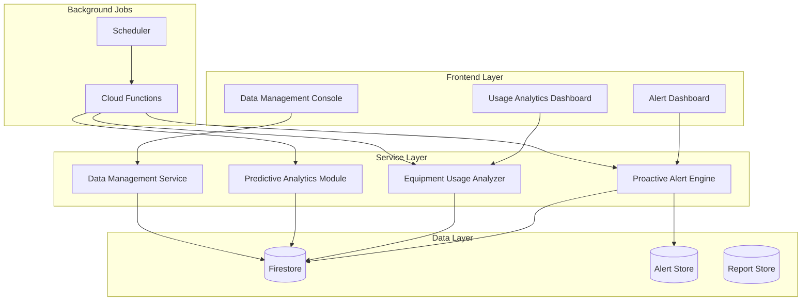

# Design Document: Admin Intelligence Assistant

## Overview

ระบบ Admin Intelligence Assistant เป็นระบบช่วยเหลือผู้ดูแลระบบแบบ Proactive โดยมีสถาปัตยกรรมแบบ Event-Driven ที่ตรวจจับและแจ้งเตือนปัญหาอัตโนมัติ วิเคราะห์ข้อมูลเพื่อคาดการณ์แนวโน้ม และให้เครื่องมือจัดการข้อมูลขั้นสูง

ระบบประกอบด้วย 4 โมดูลหลัก:
1. **Proactive Alert Engine** - ตรวจจับและสร้างการแจ้งเตือนอัตโนมัติ
2. **Equipment Usage Analyzer** - วิเคราะห์การใช้งานอุปกรณ์
3. **Predictive Analytics Module** - คาดการณ์ปัญหาและแนวโน้ม
4. **Data Management Console** - จัดการ export/import/delete ข้อมูล

## Architecture



## Components and Interfaces

### 1. Proactive Alert Engine

```javascript
// src/services/proactiveAlertService.js

/**
 * Alert priority levels
 */
const ALERT_PRIORITY = {
  CRITICAL: 'critical',
  HIGH: 'high',
  MEDIUM: 'medium',
  LOW: 'low'
};

/**
 * Alert types
 */
const ALERT_TYPE = {
  OVERDUE_LOAN: 'overdue_loan',
  NO_SHOW_RESERVATION: 'no_show_reservation',
  HIGH_DEMAND_EQUIPMENT: 'high_demand_equipment',
  IDLE_EQUIPMENT: 'idle_equipment',
  LATE_RETURN_RISK: 'late_return_risk',
  DEMAND_EXCEEDS_SUPPLY: 'demand_exceeds_supply',
  LOW_RELIABILITY_USER: 'low_reliability_user',
  REPEAT_NO_SHOW_USER: 'repeat_no_show_user'
};

/**
 * Alert interface
 */
interface Alert {
  id: string;
  type: ALERT_TYPE;
  priority: ALERT_PRIORITY;
  title: string;
  description: string;
  sourceId: string;           // ID of related entity (loan, reservation, equipment, user)
  sourceType: string;         // 'loan', 'reservation', 'equipment', 'user'
  sourceData: object;         // Snapshot of related data
  quickActions: QuickAction[];
  createdAt: Timestamp;
  resolvedAt: Timestamp | null;
  resolvedBy: string | null;
  resolvedAction: string | null;
}

/**
 * Quick action interface
 */
interface QuickAction {
  id: string;
  label: string;
  action: string;             // 'send_reminder', 'mark_contacted', 'cancel', 'extend', etc.
  params: object;
}

/**
 * Calculate alert priority based on overdue days
 * @param {number} daysOverdue - Number of days overdue
 * @returns {string} Alert priority
 */
function calculateOverduePriority(daysOverdue) {
  if (daysOverdue >= 3) return ALERT_PRIORITY.CRITICAL;
  if (daysOverdue >= 1) return ALERT_PRIORITY.HIGH;
  return ALERT_PRIORITY.MEDIUM;
}

/**
 * Check if reservation is a no-show
 * @param {object} reservation - Reservation object
 * @param {Date} currentTime - Current time
 * @returns {boolean} True if no-show
 */
function isNoShow(reservation, currentTime) {
  const startTime = reservation.startTime.toDate();
  const pickupDeadline = new Date(startTime.getTime() + 2 * 60 * 60 * 1000); // 2 hours
  return currentTime > pickupDeadline && reservation.status === 'ready';
}
```

### 2. Equipment Usage Analyzer

```javascript
// src/services/equipmentUsageAnalyzerService.js

/**
 * Equipment classification
 */
const EQUIPMENT_CLASSIFICATION = {
  HIGH_DEMAND: 'high_demand',
  NORMAL: 'normal',
  IDLE: 'idle'
};

/**
 * Utilization thresholds
 */
const UTILIZATION_THRESHOLDS = {
  HIGH_DEMAND: 0.8,    // 80% utilization
  IDLE_DAYS: 60        // 60 days without loan
};

/**
 * Equipment utilization data
 */
interface EquipmentUtilization {
  equipmentId: string;
  equipmentName: string;
  totalDays: number;
  borrowedDays: number;
  utilizationRate: number;
  classification: EQUIPMENT_CLASSIFICATION;
  lastBorrowedDate: Date | null;
  totalLoans: number;
  averageLoanDuration: number;
}

/**
 * Calculate utilization rate
 * @param {number} borrowedDays - Days equipment was borrowed
 * @param {number} totalDays - Total days in period
 * @returns {number} Utilization rate (0-1)
 */
function calculateUtilizationRate(borrowedDays, totalDays) {
  if (totalDays <= 0) return 0;
  return Math.min(borrowedDays / totalDays, 1);
}

/**
 * Classify equipment based on utilization
 * @param {number} utilizationRate - Utilization rate (0-1)
 * @param {Date|null} lastBorrowedDate - Last borrowed date
 * @param {Date} currentDate - Current date
 * @returns {string} Equipment classification
 */
function classifyEquipment(utilizationRate, lastBorrowedDate, currentDate) {
  if (utilizationRate >= UTILIZATION_THRESHOLDS.HIGH_DEMAND) {
    return EQUIPMENT_CLASSIFICATION.HIGH_DEMAND;
  }
  
  if (lastBorrowedDate) {
    const daysSinceLastBorrow = Math.floor(
      (currentDate - lastBorrowedDate) / (1000 * 60 * 60 * 24)
    );
    if (daysSinceLastBorrow >= UTILIZATION_THRESHOLDS.IDLE_DAYS) {
      return EQUIPMENT_CLASSIFICATION.IDLE;
    }
  } else {
    // Never borrowed
    return EQUIPMENT_CLASSIFICATION.IDLE;
  }
  
  return EQUIPMENT_CLASSIFICATION.NORMAL;
}
```

### 3. User Reliability Tracker

```javascript
// src/services/userReliabilityService.js

/**
 * User reliability data
 */
interface UserReliability {
  userId: string;
  userName: string;
  totalLoans: number;
  onTimeReturns: number;
  lateReturns: number;
  onTimeReturnRate: number;
  totalReservations: number;
  noShows: number;
  noShowRate: number;
  reliabilityScore: number;
  classification: 'excellent' | 'good' | 'fair' | 'poor';
  recentNoShows: number;      // No-shows in last 30 days
  isRepeatOffender: boolean;
}

/**
 * Calculate reliability score
 * Score = (onTimeReturnRate * 0.6) + ((1 - noShowRate) * 0.4)
 * @param {number} onTimeReturnRate - On-time return rate (0-1)
 * @param {number} noShowRate - No-show rate (0-1)
 * @returns {number} Reliability score (0-100)
 */
function calculateReliabilityScore(onTimeReturnRate, noShowRate) {
  const returnWeight = 0.6;
  const noShowWeight = 0.4;
  const score = (onTimeReturnRate * returnWeight + (1 - noShowRate) * noShowWeight) * 100;
  return Math.round(Math.max(0, Math.min(100, score)));
}

/**
 * Check if user is repeat no-show offender
 * @param {number} recentNoShows - No-shows in last 30 days
 * @returns {boolean} True if repeat offender
 */
function isRepeatNoShowOffender(recentNoShows) {
  return recentNoShows >= 3;
}

/**
 * Classify user based on reliability score
 * @param {number} reliabilityScore - Reliability score (0-100)
 * @returns {string} Classification
 */
function classifyUser(reliabilityScore) {
  if (reliabilityScore >= 90) return 'excellent';
  if (reliabilityScore >= 70) return 'good';
  if (reliabilityScore >= 50) return 'fair';
  return 'poor';
}
```

### 4. Data Management Service

```javascript
// src/services/dataManagementService.js

/**
 * Export format types
 */
const EXPORT_FORMAT = {
  CSV: 'csv',
  JSON: 'json'
};

/**
 * Data types for export/import/delete
 */
const DATA_TYPE = {
  LOANS: 'loans',
  RESERVATIONS: 'reservations',
  EQUIPMENT: 'equipment'
};

/**
 * Export options
 */
interface ExportOptions {
  dataType: DATA_TYPE;
  format: EXPORT_FORMAT;
  dateRange: {
    start: Date;
    end: Date;
  };
  filters: {
    status?: string[];
    category?: string[];
  };
  includeArchived: boolean;
}

/**
 * Import result
 */
interface ImportResult {
  success: boolean;
  totalRecords: number;
  importedRecords: number;
  failedRecords: number;
  errors: ImportError[];
  rollbackId: string | null;
}

/**
 * Delete options
 */
interface DeleteOptions {
  dataTypes: DATA_TYPE[];
  dateRange: {
    start: Date;
    end: Date;
  };
  createBackup: boolean;
  confirmationPhrase: string;
}

/**
 * Validate import data
 * @param {object[]} data - Data to validate
 * @param {string} dataType - Type of data
 * @returns {ValidationResult} Validation result
 */
function validateImportData(data, dataType) {
  const errors = [];
  const validRecords = [];
  
  data.forEach((record, index) => {
    const recordErrors = validateRecord(record, dataType);
    if (recordErrors.length > 0) {
      errors.push({ index, record, errors: recordErrors });
    } else {
      validRecords.push(record);
    }
  });
  
  return {
    isValid: errors.length === 0,
    validRecords,
    errors,
    totalRecords: data.length,
    validCount: validRecords.length,
    errorCount: errors.length
  };
}

/**
 * Convert data to CSV format
 * @param {object[]} data - Data to convert
 * @param {string[]} fields - Fields to include
 * @returns {string} CSV string
 */
function convertToCSV(data, fields) {
  const header = fields.join(',');
  const rows = data.map(record => 
    fields.map(field => escapeCSVField(record[field])).join(',')
  );
  return [header, ...rows].join('\n');
}

/**
 * Convert data to JSON format
 * @param {object[]} data - Data to convert
 * @returns {string} JSON string
 */
function convertToJSON(data) {
  return JSON.stringify(data, null, 2);
}
```

## Data Models

### Alert Collection (Firestore: `adminAlerts`)

```javascript
{
  id: string,
  type: string,               // ALERT_TYPE enum
  priority: string,           // ALERT_PRIORITY enum
  title: string,
  description: string,
  sourceId: string,
  sourceType: string,
  sourceData: {
    // Snapshot of related entity
  },
  quickActions: [
    {
      id: string,
      label: string,
      action: string,
      params: object
    }
  ],
  isResolved: boolean,
  resolvedAt: Timestamp | null,
  resolvedBy: string | null,
  resolvedAction: string | null,
  createdAt: Timestamp,
  updatedAt: Timestamp
}
```

### Equipment Utilization Collection (Firestore: `equipmentUtilization`)

```javascript
{
  equipmentId: string,
  period: string,             // 'monthly_2026_01'
  totalDays: number,
  borrowedDays: number,
  utilizationRate: number,
  classification: string,
  lastBorrowedDate: Timestamp | null,
  totalLoans: number,
  averageLoanDuration: number,
  calculatedAt: Timestamp
}
```

### User Reliability Collection (Firestore: `userReliability`)

```javascript
{
  userId: string,
  totalLoans: number,
  onTimeReturns: number,
  lateReturns: number,
  onTimeReturnRate: number,
  totalReservations: number,
  noShows: number,
  noShowRate: number,
  reliabilityScore: number,
  classification: string,
  recentNoShows: number,
  isRepeatOffender: boolean,
  lastCalculatedAt: Timestamp
}
```

### Data Archive Collection (Firestore: `dataArchives`)

```javascript
{
  id: string,
  archiveType: string,        // 'pre_delete_backup', 'scheduled_backup'
  dataTypes: string[],        // ['loans', 'reservations']
  dateRange: {
    start: Timestamp,
    end: Timestamp
  },
  recordCount: number,
  storageUrl: string,         // Cloud Storage URL
  createdBy: string,
  createdAt: Timestamp,
  expiresAt: Timestamp        // Auto-delete after 30 days
}
```

### Scheduled Reports Collection (Firestore: `scheduledReports`)

```javascript
{
  id: string,
  reportType: string,         // 'daily_summary', 'weekly_utilization'
  period: string,             // '2026-01-07', '2026-W01'
  data: {
    // Report data
  },
  generatedAt: Timestamp,
  viewedBy: string[],
  downloadCount: number
}
```

## Correctness Properties

*A property is a characteristic or behavior that should hold true across all valid executions of a system-essentially, a formal statement about what the system should do. Properties serve as the bridge between human-readable specifications and machine-verifiable correctness guarantees.*

### Property 1: Alert Priority Escalation

*For any* overdue loan, the alert priority SHALL be calculated correctly based on days overdue:
- 0 days overdue → medium priority
- 1-2 days overdue → high priority  
- 3+ days overdue → critical priority

**Validates: Requirements 1.1, 1.2**

### Property 2: No-Show Detection Timing

*For any* reservation with status 'ready', if the current time is more than 2 hours after the start time, the reservation SHALL be classified as a no-show.

**Validates: Requirements 2.1**

### Property 3: Repeat No-Show Offender Detection

*For any* user with 3 or more no-shows in the past 30 days, the system SHALL flag them as a repeat no-show offender.

**Validates: Requirements 2.4, 2.5**

### Property 4: Equipment Utilization Classification

*For any* equipment item:
- If utilization rate >= 80% in past 30 days → classified as high-demand
- If not borrowed in past 60 days → classified as idle
- Otherwise → classified as normal

**Validates: Requirements 3.2, 3.3**

### Property 5: Utilization Rate Calculation

*For any* equipment with loan history, the utilization rate SHALL equal (borrowed days / total days) and be bounded between 0 and 1.

**Validates: Requirements 3.1**

### Property 6: User Reliability Score Calculation

*For any* user, the reliability score SHALL be calculated as:
`(onTimeReturnRate * 0.6 + (1 - noShowRate) * 0.4) * 100`
and be bounded between 0 and 100.

**Validates: Requirements 10.1**

### Property 7: Low Reliability User Flagging

*For any* user with reliability score below 50%, the system SHALL flag them for review.

**Validates: Requirements 10.2**

### Property 8: Export Data Completeness

*For any* data export, the exported data SHALL contain all required fields (id, timestamps, user information) for each record.

**Validates: Requirements 5.4**

### Property 9: Export Format Validity

*For any* CSV export, the output SHALL be valid CSV format. *For any* JSON export, the output SHALL be valid JSON format.

**Validates: Requirements 5.2**

### Property 10: Export Filter Correctness

*For any* export with date range filter, all exported records SHALL have timestamps within the specified date range.

**Validates: Requirements 5.3**

### Property 11: Import Validation

*For any* import data, records with validation errors SHALL NOT be imported, and detailed error messages SHALL be generated for each invalid record.

**Validates: Requirements 6.2, 6.3**

### Property 12: Import Rollback on Failure

*For any* failed import operation, no data SHALL be persisted to the database (atomic operation).

**Validates: Requirements 6.5**

### Property 13: Delete Backup Creation

*For any* data deletion operation, an archive backup SHALL be created before any data is deleted.

**Validates: Requirements 7.3**

### Property 14: Delete Date Range Filter

*For any* deletion with date range filter, only records within the specified date range SHALL be deleted.

**Validates: Requirements 7.4**

### Property 15: Delete Audit Logging

*For any* data deletion operation, an audit log entry SHALL be created containing the admin ID, timestamp, data types, and record count.

**Validates: Requirements 7.6**

### Property 16: Delete Rollback on Failure

*For any* failed deletion operation, the system SHALL restore data from the archive backup automatically.

**Validates: Requirements 7.7**

### Property 17: Alert Grouping by Priority

*For any* set of alerts, when grouped by priority, each alert SHALL appear in exactly one priority group matching its priority level.

**Validates: Requirements 8.2**

### Property 18: Alert Display Completeness

*For any* displayed alert, the display SHALL include type, description, timestamp, and available quick actions.

**Validates: Requirements 8.3**

### Property 19: Alert Filter Correctness

*For any* alert filter operation, the filtered results SHALL only contain alerts matching all specified filter criteria.

**Validates: Requirements 8.4**

### Property 20: Alert Resolution Logging

*For any* alert that is resolved, the system SHALL record the resolution timestamp, admin ID, and action taken.

**Validates: Requirements 8.5**

### Property 21: Alert Statistics Accuracy

*For any* set of alerts, the statistics (total, resolved, pending) SHALL accurately reflect the actual counts.

**Validates: Requirements 8.6**

### Property 22: Report Storage

*For any* generated scheduled report, the report SHALL be persisted and retrievable for later viewing.

**Validates: Requirements 9.3**

### Property 23: User Statistics Accuracy

*For any* user, the displayed statistics (on-time return rate, no-show rate, total loans) SHALL accurately reflect their actual history.

**Validates: Requirements 10.3**

### Property 24: Top User Identification

*For any* set of users, the system SHALL correctly identify the top borrowers (by loan count) and most reliable users (by reliability score).

**Validates: Requirements 10.5**

## Error Handling

### Alert Engine Errors

| Error Type | Handling Strategy |
|------------|-------------------|
| Database read failure | Retry with exponential backoff, log error, continue with cached data |
| Alert creation failure | Log error, queue for retry, notify admin via fallback channel |
| Quick action failure | Show error to user, allow retry, log for investigation |

### Data Management Errors

| Error Type | Handling Strategy |
|------------|-------------------|
| Export failure | Show progress, allow resume, provide partial download option |
| Import validation error | Show detailed errors, allow correction, do not import invalid records |
| Import database error | Rollback all changes, restore original state, show error details |
| Delete failure | Restore from backup, log error, notify admin |
| Backup creation failure | Abort delete operation, show error, require manual intervention |

### Analytics Errors

| Error Type | Handling Strategy |
|------------|-------------------|
| Calculation error | Use default values, log error, flag data as potentially inaccurate |
| Missing data | Skip record, continue processing, note in report |
| Timeout | Return partial results, schedule background completion |

## Testing Strategy

### Unit Tests

Unit tests will verify specific examples and edge cases:

1. **Alert Priority Calculation**
   - Test boundary conditions (0, 1, 2, 3 days overdue)
   - Test negative days (not yet due)

2. **No-Show Detection**
   - Test exactly at 2-hour boundary
   - Test various reservation statuses

3. **Utilization Calculation**
   - Test zero days, full utilization
   - Test equipment never borrowed

4. **Reliability Score**
   - Test perfect user (100% on-time, 0% no-show)
   - Test worst case user (0% on-time, 100% no-show)

5. **CSV/JSON Export**
   - Test special characters escaping
   - Test empty data sets

6. **Import Validation**
   - Test missing required fields
   - Test invalid data types

### Property-Based Tests

Property-based tests will use **fast-check** library with minimum 100 iterations per test.

Each property test will be tagged with:
`**Feature: admin-intelligence-assistant, Property {number}: {property_text}**`

Property tests will cover:
- Alert priority calculation for random overdue durations
- No-show detection for random reservation times
- Equipment classification for random utilization data
- User reliability score for random user histories
- Export/import round-trip consistency
- Filter correctness for random filter combinations
- Statistics accuracy for random data sets

### Integration Tests

1. **End-to-end alert flow**: Create overdue loan → Verify alert created → Resolve alert → Verify logged
2. **Export/Import cycle**: Export data → Import to test environment → Verify data integrity
3. **Delete with backup**: Create backup → Delete data → Verify backup exists → Restore if needed
