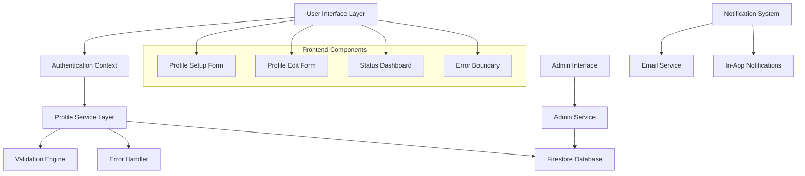
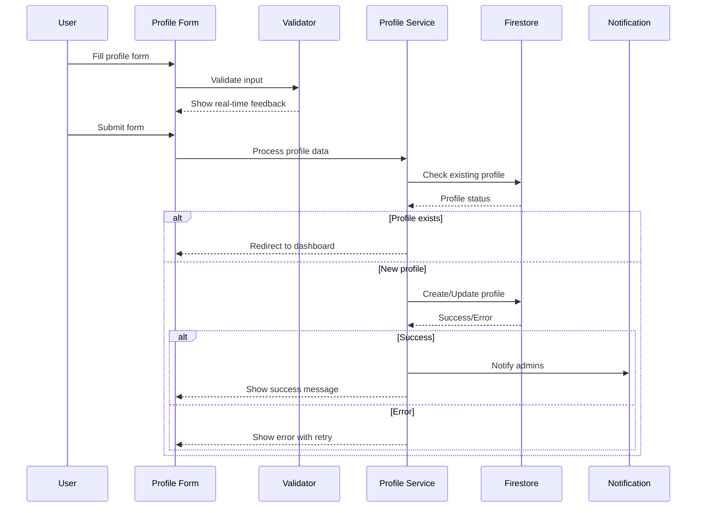

# Design Document

## Overview

การออกแบบระบบปรับปรุงการจัดการโปรไฟล์และสมัครสมาชิกสำหรับระบบยืม-คืนอุปกรณ์ โดยเน้นการแก้ไขปัญหา Firestore permission errors, ปรับปรุง UX/UI, และเพิ่มความน่าเชื่อถือของระบบ

## Architecture

### System Components



### Data Flow Architecture



## Components and Interfaces

### 1. Enhanced Profile Form Component

**ProfileSetupForm.js**
- **Purpose**: ปรับปรุงฟอร์มสมัครสมาชิกให้มี UX ที่ดีขึ้น
- **Key Features**:
  - Real-time validation with visual feedback
  - Department dropdown with search functionality
  - Progress indicator
  - Auto-save draft functionality
  - Network error handling with retry mechanism

**Interface Design**:
```javascript
interface ProfileFormProps {
  initialData?: UserProfile;
  onSubmit: (data: UserProfile) => Promise<void>;
  onSaveDraft: (data: Partial<UserProfile>) => void;
  isEditing?: boolean;
}

interface UserProfile {
  firstName: string;
  lastName: string;
  phoneNumber: string;
  department: DepartmentOption;
  userType: 'student' | 'teacher' | 'staff';
  status: 'incomplete' | 'pending' | 'approved' | 'rejected';
}
```

### 2. Department Selection Component

**DepartmentSelector.js**
- **Purpose**: Dropdown component สำหรับเลือกสังกัด
- **Features**:
  - Searchable dropdown
  - Thai language support
  - Keyboard navigation
  - Accessibility compliance

```javascript
const DEPARTMENTS = [
  { value: 'accounting', label: 'สาขาวิชาการบัญชี' },
  { value: 'digital-business', label: 'สาขาวิชาการจัดการธุรกิจดิจิทัล' },
  { value: 'business-admin', label: 'สาขาวิชาบริหารธุรกิจ' },
  { value: 'management', label: 'สาขาวิชาการจัดการ' },
  { value: 'computer-business', label: 'สาขาวิชาคอมพิวเตอร์ธุรกิจ' },
  { value: 'communication', label: 'สาขาวิชานิเทศศาสตร์' },
  { value: 'logistics', label: 'สาขาวิชาโลจิสติกส์และธุรกิจระหว่างประเทศ' },
  { value: 'tourism', label: 'สาขานวัตกรรมการท่องเที่ยวและธุรกิจบริการ' },
  { value: 'modern-business', label: 'สาขาวิชาการจัดการธุรกิจสมัยใหม่' },
  { value: 'dean-office', label: 'สำนักงานคณบดี' }
];
```

### 3. Enhanced Error Handling System

**ErrorBoundary.js & ErrorHandler.js**
- **Purpose**: จัดการข้อผิดพลาดอย่างครอบคลุม
- **Features**:
  - Categorized error types
  - Thai language error messages
  - Retry mechanisms
  - Error reporting to admin

```javascript
interface ErrorState {
  type: 'network' | 'permission' | 'validation' | 'unknown';
  message: string;
  retryable: boolean;
  retryCount: number;
  originalError: Error;
}
```

### 4. Profile Status Tracker

**ProfileStatusTracker.js**
- **Purpose**: แสดงสถานะและความคืบหน้าของโปรไฟล์
- **Features**:
  - Visual progress indicators
  - Status-specific messaging
  - Next steps guidance
  - Estimated approval time

```javascript
interface ProfileStatus {
  current: 'incomplete' | 'pending' | 'approved' | 'rejected';
  progress: number; // 0-100
  nextSteps: string[];
  estimatedApprovalTime?: string;
  lastUpdated: Date;
}
```

### 5. Duplicate Detection Service

**DuplicateDetectionService.js**
- **Purpose**: ตรวจสอบและป้องกันการสมัครซ้ำ
- **Logic**:
  - Check by email address
  - Check by phone number (optional)
  - Handle edge cases (deleted accounts, etc.)

## Data Models

### Enhanced User Profile Model

```javascript
interface UserProfile {
  // Core identification
  uid: string;
  email: string;
  
  // Profile information
  firstName: string;
  lastName: string;
  phoneNumber: string;
  department: {
    value: string;
    label: string;
  };
  userType: 'student' | 'teacher' | 'staff';
  
  // System fields
  status: 'incomplete' | 'pending' | 'approved' | 'rejected';
  role: 'user' | 'admin';
  
  // Metadata
  createdAt: Timestamp;
  updatedAt: Timestamp;
  lastLoginAt?: Timestamp;
  profileCompletedAt?: Timestamp;
  approvedAt?: Timestamp;
  approvedBy?: string;
  
  // Additional fields
  photoURL?: string;
  displayName?: string;
  notes?: string; // Admin notes
  
  // Draft functionality
  draftData?: Partial<UserProfile>;
  draftSavedAt?: Timestamp;
}
```

### Profile Validation Rules

```javascript
interface ValidationRules {
  firstName: {
    required: true;
    minLength: 1;
    maxLength: 50;
    pattern: /^[ก-๙a-zA-Z\s]+$/;
  };
  lastName: {
    required: true;
    minLength: 1;
    maxLength: 50;
    pattern: /^[ก-๙a-zA-Z\s]+$/;
  };
  phoneNumber: {
    required: true;
    pattern: /^[0-9]{9,10}$/;
    format: 'Thai mobile number';
  };
  department: {
    required: true;
    enum: DEPARTMENTS.map(d => d.value);
  };
  userType: {
    required: true;
    enum: ['student', 'teacher', 'staff'];
  };
}
```

## Error Handling

### Error Classification System

```javascript
const ERROR_TYPES = {
  // Network related
  NETWORK_ERROR: {
    code: 'NETWORK_ERROR',
    message: 'ไม่สามารถเชื่อมต่อกับเซิร์ฟเวอร์ได้ กรุณาตรวจสอบการเชื่อมต่ออินเทอร์เน็ต',
    retryable: true,
    retryDelay: 2000
  },
  
  // Permission related
  PERMISSION_DENIED: {
    code: 'PERMISSION_DENIED',
    message: 'ไม่มีสิทธิ์ในการดำเนินการ กรุณาลองใหม่หรือติดต่อผู้ดูแลระบบ',
    retryable: true,
    retryDelay: 1000
  },
  
  // Validation related
  VALIDATION_ERROR: {
    code: 'VALIDATION_ERROR',
    message: 'ข้อมูลที่กรอกไม่ถูกต้อง กรุณาตรวจสอบและแก้ไข',
    retryable: false
  },
  
  // Duplicate detection
  DUPLICATE_PROFILE: {
    code: 'DUPLICATE_PROFILE',
    message: 'พบบัญชีผู้ใช้นี้ในระบบแล้ว',
    retryable: false
  }
};
```

### Retry Strategy

```javascript
class RetryHandler {
  static async executeWithRetry(operation, maxRetries = 3) {
    let lastError;
    
    for (let attempt = 1; attempt <= maxRetries; attempt++) {
      try {
        return await operation();
      } catch (error) {
        lastError = error;
        
        if (!this.isRetryable(error) || attempt === maxRetries) {
          throw error;
        }
        
        const delay = this.calculateDelay(attempt);
        await this.sleep(delay);
      }
    }
    
    throw lastError;
  }
  
  static calculateDelay(attempt) {
    return Math.min(1000 * Math.pow(2, attempt - 1), 10000);
  }
}
```

## Testing Strategy

### Unit Testing Focus Areas

1. **Form Validation**
   - Field validation rules
   - Real-time validation feedback
   - Error message display

2. **Profile Service**
   - CRUD operations
   - Error handling
   - Retry mechanisms

3. **Duplicate Detection**
   - Email-based detection
   - Edge case handling

### Integration Testing

1. **Firestore Integration**
   - Profile creation/update
   - Permission validation
   - Security rules testing

2. **Authentication Flow**
   - Google SSO integration
   - Profile status transitions
   - Redirect logic

### User Experience Testing

1. **Form Usability**
   - Field completion flow
   - Error recovery
   - Mobile responsiveness

2. **Network Resilience**
   - Offline behavior
   - Connection recovery
   - Data persistence

## Security Considerations

### Updated Firestore Rules

```javascript
// Enhanced security rules for profile management
rules_version = '2';
service cloud.firestore {
  match /databases/{database}/documents {
    
    // Helper functions
    function isAuthenticated() {
      return request.auth != null;
    }
    
    function isOwner(userId) {
      return isAuthenticated() && request.auth.uid == userId;
    }
    
    function hasValidEmail() {
      return isAuthenticated() && 
             (request.auth.token.email.matches('.*@gmail\\.com$') || 
              request.auth.token.email.matches('.*@g\\.lpru\\.ac\\.th$'));
    }
    
    function isValidProfileData(data) {
      return data.keys().hasAll(['firstName', 'lastName', 'phoneNumber', 'department', 'userType']) &&
             data.firstName is string && data.firstName.size() > 0 && data.firstName.size() <= 50 &&
             data.lastName is string && data.lastName.size() > 0 && data.lastName.size() <= 50 &&
             data.phoneNumber is string && data.phoneNumber.matches('^[0-9]{9,10}$') &&
             data.department is map && data.department.keys().hasAll(['value', 'label']) &&
             data.userType in ['student', 'teacher', 'staff'];
    }
    
    function isValidStatusTransition(oldStatus, newStatus) {
      return (oldStatus == newStatus) ||
             (oldStatus == 'incomplete' && newStatus == 'pending') ||
             (oldStatus == 'pending' && newStatus in ['approved', 'rejected']);
    }
    
    // Users collection with enhanced validation
    match /users/{userId} {
      allow read: if isOwner(userId);
      
      allow create: if isOwner(userId) && 
                       hasValidEmail() && 
                       isValidProfileData(request.resource.data) &&
                       request.resource.data.uid == request.auth.uid &&
                       request.resource.data.email == request.auth.token.email &&
                       request.resource.data.status in ['incomplete', 'pending'];
      
      allow update: if isOwner(userId) && 
                       hasValidEmail() &&
                       isValidProfileData(request.resource.data) &&
                       isValidStatusTransition(resource.data.status, request.resource.data.status) &&
                       !request.resource.data.keys().hasAny(['uid', 'email', 'role', 'createdAt', 'approvedAt', 'approvedBy']);
    }
  }
}
```

### Data Validation

1. **Client-side Validation**
   - Real-time field validation
   - Format checking
   - Required field validation

2. **Server-side Validation**
   - Firestore security rules
   - Data integrity checks
   - Business logic validation

## Performance Optimization

### Frontend Optimization

1. **Component Optimization**
   - React.memo for form components
   - Debounced validation
   - Lazy loading for department options

2. **State Management**
   - Optimistic updates
   - Local state caching
   - Draft auto-save

### Backend Optimization

1. **Firestore Optimization**
   - Efficient query patterns
   - Proper indexing
   - Batch operations where applicable

2. **Caching Strategy**
   - Department list caching
   - User profile caching
   - Static data caching

## Accessibility Features

1. **Keyboard Navigation**
   - Tab order optimization
   - Keyboard shortcuts
   - Focus management

2. **Screen Reader Support**
   - ARIA labels
   - Semantic HTML
   - Error announcements

3. **Visual Accessibility**
   - High contrast mode support
   - Font size scaling
   - Color-blind friendly design

## Mobile Responsiveness

1. **Responsive Design**
   - Mobile-first approach
   - Touch-friendly interfaces
   - Optimized form layouts

2. **Progressive Web App Features**
   - Offline form drafts
   - Push notifications
   - App-like experience