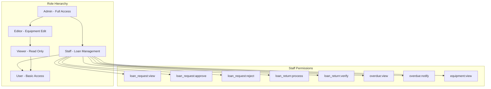

# Design Document: Staff Role System

## Overview

ระบบบทบาท Staff เป็นการขยายระบบสิทธิ์ที่มีอยู่ (permissionService.js) โดยเพิ่มบทบาทใหม่ "staff" ที่อยู่ระหว่าง user และ admin ในลำดับชั้นสิทธิ์ Staff จะมีสิทธิ์เฉพาะในการจัดการคำขอยืม-คืนอุปกรณ์ แต่ไม่สามารถเข้าถึงระบบจัดการอื่นๆ ได้

### Key Design Decisions

1. **Extend Existing Permission System**: ใช้โครงสร้าง PermissionService ที่มีอยู่แล้ว เพิ่ม role และ permissions ใหม่
2. **Role Hierarchy**: Admin > Staff > Editor > Viewer > User
3. **Notification Integration**: ใช้ระบบ adminNotificationService ที่มีอยู่สำหรับแจ้งเตือน Admin
4. **Audit Logging**: ใช้ activityLoggerService ที่มีอยู่สำหรับบันทึก Staff actions

## Architecture



## Components and Interfaces

### 1. Extended PermissionService

```javascript
// src/services/permissionService.js - Extended

class PermissionService {
  static ROLES = {
    USER: 'user',
    VIEWER: 'viewer',
    EDITOR: 'editor',
    STAFF: 'staff',      // NEW
    ADMIN: 'admin'
  };

  static PERMISSIONS = {
    // Existing permissions...
    
    // NEW: Loan Management Permissions
    LOAN_REQUEST_VIEW: 'loan_request:view',
    LOAN_REQUEST_APPROVE: 'loan_request:approve',
    LOAN_REQUEST_REJECT: 'loan_request:reject',
    LOAN_RETURN_PROCESS: 'loan_return:process',
    LOAN_RETURN_VERIFY: 'loan_return:verify',
    OVERDUE_VIEW: 'overdue:view',
    OVERDUE_NOTIFY: 'overdue:notify'
  };

  static ROLE_PERMISSIONS = {
    // Existing roles...
    
    [this.ROLES.STAFF]: [
      this.PERMISSIONS.EQUIPMENT_VIEW,
      this.PERMISSIONS.LOAN_REQUEST_VIEW,
      this.PERMISSIONS.LOAN_REQUEST_APPROVE,
      this.PERMISSIONS.LOAN_REQUEST_REJECT,
      this.PERMISSIONS.LOAN_RETURN_PROCESS,
      this.PERMISSIONS.LOAN_RETURN_VERIFY,
      this.PERMISSIONS.OVERDUE_VIEW,
      this.PERMISSIONS.OVERDUE_NOTIFY,
      this.PERMISSIONS.REPORT_VIEW
    ]
  };
}
```

### 2. Staff Dashboard Component

```javascript
// src/components/staff/StaffDashboard.js

interface StaffDashboardProps {
  userId: string;
}

interface StaffStats {
  pendingRequests: number;
  activeLoans: number;
  overdueLoans: number;
  todayReturns: number;
  recentActivity: StaffActivity[];
}

interface StaffActivity {
  id: string;
  type: 'approve' | 'reject' | 'return' | 'notify';
  timestamp: Date;
  details: {
    requestId?: string;
    borrowerName?: string;
    equipmentName?: string;
    reason?: string;
  };
}
```

### 3. Loan Management Service Extension

```javascript
// src/services/loanManagementService.js - Extended

interface LoanApprovalResult {
  success: boolean;
  requestId: string;
  newStatus: 'approved' | 'rejected';
  reason?: string;
  notificationSent: boolean;
  equipmentUpdated: boolean;
}

interface ReturnProcessResult {
  success: boolean;
  loanId: string;
  condition: 'good' | 'damaged' | 'missing_parts';
  damageReportId?: string;
  equipmentAvailable: boolean;
}
```

### 4. Staff Activity Notification Service

```javascript
// src/services/staffActivityNotificationService.js

interface StaffActionNotification {
  staffId: string;
  staffName: string;
  actionType: 'loan_approved' | 'loan_rejected' | 'return_processed' | 'overdue_notified';
  timestamp: Date;
  details: {
    requestId?: string;
    loanId?: string;
    borrowerName: string;
    equipmentName: string;
    condition?: string;
    reason?: string;
  };
  priority: 'normal' | 'high';
}
```

## Data Models

### User Document Extension

```javascript
// Firestore: users/{userId}
{
  // Existing fields...
  role: 'staff',  // NEW: Can be 'user', 'viewer', 'editor', 'staff', 'admin'
  staffAssignedAt: Timestamp,  // NEW: When user was assigned Staff role
  staffAssignedBy: string      // NEW: Admin who assigned the role
}
```

### Staff Activity Log

```javascript
// Firestore: staffActivityLogs/{logId}
{
  staffId: string,
  staffName: string,
  actionType: string,
  timestamp: Timestamp,
  details: {
    requestId: string,
    loanId: string,
    borrowerName: string,
    equipmentName: string,
    condition: string,
    reason: string
  },
  adminNotified: boolean,
  adminNotificationId: string
}
```

### Staff Daily Summary

```javascript
// Firestore: staffDailySummaries/{date}_{staffId}
{
  staffId: string,
  date: string,  // YYYY-MM-DD
  approvedCount: number,
  rejectedCount: number,
  returnsProcessed: number,
  overdueNotificationsSent: number,
  damageReportsCreated: number
}
```

## Correctness Properties

*A property is a characteristic or behavior that should hold true across all valid executions of a system-essentially, a formal statement about what the system should do. Properties serve as the bridge between human-readable specifications and machine-verifiable correctness guarantees.*

### Property 1: Staff Permission Boundary

*For any* user with Staff role, checking any permission in the granted list (loan_request:view, loan_request:approve, loan_request:reject, loan_return:process, loan_return:verify, overdue:view, overdue:notify, equipment:view) SHALL return true, and checking any permission NOT in the granted list SHALL return false.

**Validates: Requirements 2.1, 2.2, 2.3**

### Property 2: Role Hierarchy Inheritance

*For any* Admin user, checking any Staff permission SHALL return true. The permission set of Admin SHALL be a superset of Staff permissions.

**Validates: Requirements 11.1, 11.7**

### Property 3: Loan Approval State Transition

*For any* pending loan request, when a Staff user approves it:
- The request status SHALL change to "approved"
- The equipment availability SHALL be updated
- A notification SHALL be sent to the borrower
- An audit log entry SHALL be created

**Validates: Requirements 4.1, 4.4, 4.5, 10.1**

### Property 4: Loan Rejection State Transition

*For any* pending loan request with a rejection reason, when a Staff user rejects it:
- The request status SHALL change to "rejected"
- The rejection reason SHALL be stored
- A notification SHALL be sent to the borrower
- An audit log entry SHALL be created with the reason

**Validates: Requirements 4.3, 4.4, 10.2**

### Property 5: Return Processing State Transition

*For any* active loan, when a Staff user processes the return:
- The loan status SHALL change to "returned"
- The equipment availability SHALL be updated to available
- The condition assessment SHALL be stored
- An audit log entry SHALL be created

**Validates: Requirements 5.4, 5.5, 10.3**

### Property 6: Damaged Equipment Report Creation

*For any* return processed with condition "damaged" or "missing_parts":
- A damage report SHALL be created
- An Admin notification with priority "high" SHALL be sent

**Validates: Requirements 5.6, 12.8**

### Property 7: Staff Access Restriction

*For any* Staff user attempting to access restricted routes (user management, equipment management, category management, reservation management, settings, intelligence):
- Access SHALL be denied
- User SHALL be redirected to dashboard

**Validates: Requirements 7.1, 7.2, 7.3, 7.4, 7.5, 7.6**

### Property 8: Menu Visibility by Role

*For any* Staff user, the navigation menu SHALL NOT contain items for restricted pages (user management, equipment management, category management, settings, intelligence).

**Validates: Requirements 7.7, 13.4, 13.5**

### Property 9: Admin Notification for Staff Actions

*For any* Staff action (approve, reject, return, notify), an Admin notification SHALL be created containing: Staff name, action type, timestamp, and relevant details.

**Validates: Requirements 12.1, 12.2, 12.3, 12.4, 12.5**

### Property 10: Staff Action Audit Logging

*For any* Staff action, an audit log entry SHALL be created with: timestamp, staff ID, action type, and relevant details (request ID, loan ID, reason, condition).

**Validates: Requirements 10.1, 10.2, 10.3, 10.4**

### Property 11: Role Change Permission Update

*For any* user whose role is changed to "staff", the user's effective permissions SHALL immediately match the Staff permission set. *For any* user whose role is changed from "staff" to another role, Staff-specific permissions SHALL be immediately revoked.

**Validates: Requirements 8.2, 8.3**

### Property 12: Unavailable Equipment Approval Prevention

*For any* loan request for equipment that is currently unavailable, approval attempt SHALL fail with an error message.

**Validates: Requirements 4.6**

### Property 13: Overdue Loan Query Accuracy

*For any* query to the overdue management page, all returned loans SHALL have a due date in the past and status "active".

**Validates: Requirements 6.1**

### Property 14: Staff Dashboard Statistics Accuracy

*For any* Staff dashboard, the displayed counts SHALL match the actual database counts for: pending requests, active loans, overdue loans.

**Validates: Requirements 9.2, 9.3, 9.4**

## UX/UI Design

### Design Principles

ออกแบบให้สอดคล้องกับระบบหลักที่มีอยู่ โดยใช้:
- Tailwind CSS สำหรับ styling
- Component patterns เดียวกับ Admin pages
- Color scheme และ typography เดียวกัน
- Responsive design รองรับ mobile

### Staff Navigation Menu

```javascript
// เพิ่มใน Sidebar.js สำหรับ Staff role
const staffMenuItems = [
  {
    section: 'การให้บริการยืม-คืน',
    icon: 'ClipboardDocumentListIcon',
    items: [
      { name: 'จัดการคำขอยืม', path: '/staff/loan-requests', icon: 'DocumentCheckIcon' },
      { name: 'รับคืนอุปกรณ์', path: '/staff/returns', icon: 'ArrowUturnLeftIcon' },
      { name: 'รายการค้างคืน', path: '/staff/overdue', icon: 'ExclamationTriangleIcon' }
    ]
  }
];
```

### Staff Dashboard Layout

```
┌─────────────────────────────────────────────────────────────┐
│  Staff Dashboard - เจ้าหน้าที่ให้บริการยืม-คืน              │
├─────────────────────────────────────────────────────────────┤
│  ┌──────────┐  ┌──────────┐  ┌──────────┐  ┌──────────┐    │
│  │ รอดำเนินการ │  │ กำลังยืม  │  │ ค้างคืน   │  │ คืนวันนี้  │    │
│  │    12    │  │    45    │  │    3     │  │    8     │    │
│  └──────────┘  └──────────┘  └──────────┘  └──────────┘    │
├─────────────────────────────────────────────────────────────┤
│  กิจกรรมล่าสุด                                              │
│  ┌─────────────────────────────────────────────────────┐   │
│  │ 10:30 - อนุมัติคำขอยืม #1234 (กล้อง Canon)          │   │
│  │ 10:15 - รับคืนอุปกรณ์ #1230 (โปรเจคเตอร์)           │   │
│  │ 09:45 - ปฏิเสธคำขอยืม #1228 (เหตุผล: อุปกรณ์ไม่ว่าง) │   │
│  └─────────────────────────────────────────────────────┘   │
└─────────────────────────────────────────────────────────────┘
```

### Loan Request Management Page

```
┌─────────────────────────────────────────────────────────────┐
│  จัดการคำขอยืม                                    [ค้นหา]  │
├─────────────────────────────────────────────────────────────┤
│  [ทั้งหมด] [รอดำเนินการ] [อนุมัติแล้ว] [ปฏิเสธ] [คืนแล้ว]   │
├─────────────────────────────────────────────────────────────┤
│  ┌─────────────────────────────────────────────────────┐   │
│  │ คำขอ #1234                           [รอดำเนินการ]  │   │
│  │ ผู้ยืม: สมชาย ใจดี                                   │   │
│  │ อุปกรณ์: กล้อง Canon EOS R5                         │   │
│  │ ระยะเวลา: 15 ม.ค. - 20 ม.ค. 2026                    │   │
│  │ วัตถุประสงค์: ถ่ายภาพงานสัมมนา                       │   │
│  │                                                     │   │
│  │ [อนุมัติ]  [ปฏิเสธ]  [ดูรายละเอียด]                  │   │
│  └─────────────────────────────────────────────────────┘   │
└─────────────────────────────────────────────────────────────┘
```

### Return Processing Page

```
┌─────────────────────────────────────────────────────────────┐
│  รับคืนอุปกรณ์                                   [ค้นหา]   │
├─────────────────────────────────────────────────────────────┤
│  ┌─────────────────────────────────────────────────────┐   │
│  │ การยืม #1230                              [กำลังยืม] │   │
│  │ ผู้ยืม: สมหญิง รักเรียน                              │   │
│  │ อุปกรณ์: โปรเจคเตอร์ Epson                          │   │
│  │ กำหนดคืน: 18 ม.ค. 2026                              │   │
│  │                                                     │   │
│  │ [รับคืน]  [ดูรายละเอียด]                            │   │
│  └─────────────────────────────────────────────────────┘   │
├─────────────────────────────────────────────────────────────┤
│  Modal: รับคืนอุปกรณ์                                      │
│  ┌─────────────────────────────────────────────────────┐   │
│  │ สภาพอุปกรณ์:                                        │   │
│  │ ○ สมบูรณ์ดี                                         │   │
│  │ ○ มีความเสียหาย                                     │   │
│  │ ○ ขาดอุปกรณ์เสริม                                   │   │
│  │                                                     │   │
│  │ หมายเหตุ: [________________________]                │   │
│  │                                                     │   │
│  │ [ยืนยันการรับคืน]  [ยกเลิก]                         │   │
│  └─────────────────────────────────────────────────────┘   │
└─────────────────────────────────────────────────────────────┘
```

### Overdue Management Page

```
┌─────────────────────────────────────────────────────────────┐
│  รายการค้างคืน                                   [ค้นหา]   │
├─────────────────────────────────────────────────────────────┤
│  ┌─────────────────────────────────────────────────────┐   │
│  │ การยืม #1225                    [ค้างคืน 3 วัน] ⚠️  │   │
│  │ ผู้ยืม: สมศักดิ์ มานะ                                │   │
│  │ โทร: 081-234-5678                                   │   │
│  │ อุปกรณ์: ไมโครโฟน Shure SM58                        │   │
│  │ กำหนดคืน: 15 ม.ค. 2026                              │   │
│  │                                                     │   │
│  │ [ส่งการแจ้งเตือน]  [รับคืน]  [ดูรายละเอียด]         │   │
│  └─────────────────────────────────────────────────────┘   │
└─────────────────────────────────────────────────────────────┘
```

### Component Reuse

ใช้ components ที่มีอยู่แล้วในระบบ:

| Component | ใช้ใน Staff Pages |
|-----------|-------------------|
| `LoanRequestCard` | แสดงรายการคำขอยืม |
| `LoanStatusBadge` | แสดงสถานะการยืม |
| `EquipmentStatusBadge` | แสดงสถานะอุปกรณ์ |
| `OverdueIndicator` | แสดงจำนวนวันค้างคืน |
| `Pagination` | แบ่งหน้ารายการ |
| `SearchInput` | ค้นหารายการ |
| `FilterTabs` | กรองตามสถานะ |
| `Modal` | แสดง dialog ต่างๆ |
| `Toast` | แจ้งเตือนผลการทำงาน |

### Color Scheme for Staff

```javascript
// Staff-specific colors (consistent with existing system)
const staffColors = {
  primary: 'indigo',      // ปุ่มหลัก, links
  success: 'green',       // อนุมัติ, สำเร็จ
  danger: 'red',          // ปฏิเสธ, ค้างคืน
  warning: 'yellow',      // เตือน, รอดำเนินการ
  info: 'blue',           // ข้อมูล
  neutral: 'gray'         // พื้นหลัง, borders
};
```

### Responsive Design

```javascript
// Breakpoints (same as main system)
const breakpoints = {
  sm: '640px',   // Mobile
  md: '768px',   // Tablet
  lg: '1024px',  // Desktop
  xl: '1280px'   // Large Desktop
};

// Staff pages responsive behavior
// - Mobile: Single column, stacked cards
// - Tablet: 2 columns for stats, full-width cards
// - Desktop: 4 columns for stats, table view option
```

## Error Handling

### Permission Denied Errors

```javascript
class PermissionDeniedError extends Error {
  constructor(requiredPermission, userRole) {
    super(`Permission denied: ${requiredPermission} requires higher role than ${userRole}`);
    this.code = 'PERMISSION_DENIED';
    this.requiredPermission = requiredPermission;
    this.userRole = userRole;
  }
}
```

### Loan Operation Errors

```javascript
class LoanOperationError extends Error {
  constructor(operation, reason, details) {
    super(`Loan operation failed: ${operation} - ${reason}`);
    this.code = 'LOAN_OPERATION_FAILED';
    this.operation = operation;
    this.reason = reason;
    this.details = details;
  }
}
```

### Error Scenarios

| Scenario | Error Code | User Message |
|----------|------------|--------------|
| Staff accesses restricted page | PERMISSION_DENIED | คุณไม่มีสิทธิ์เข้าถึงหน้านี้ |
| Approve unavailable equipment | EQUIPMENT_UNAVAILABLE | อุปกรณ์นี้ไม่พร้อมให้ยืมในขณะนี้ |
| Process return for non-active loan | INVALID_LOAN_STATUS | ไม่สามารถรับคืนได้ เนื่องจากสถานะการยืมไม่ถูกต้อง |
| Staff tries to change user role | PERMISSION_DENIED | คุณไม่มีสิทธิ์เปลี่ยนบทบาทผู้ใช้ |

## Testing Strategy

### Unit Tests

1. **PermissionService Tests**
   - Test Staff role is defined correctly
   - Test Staff permissions are granted correctly
   - Test restricted permissions are denied for Staff
   - Test Admin has all Staff permissions

2. **LoanManagementService Tests**
   - Test approval state transition
   - Test rejection with reason storage
   - Test return processing with condition
   - Test unavailable equipment approval prevention

3. **Navigation Tests**
   - Test menu items for Staff role
   - Test restricted routes redirect for Staff

### Property-Based Tests

Using fast-check library for JavaScript:

1. **Permission Boundary Property Test**
   - Generate random permissions
   - Verify Staff has exactly the defined permissions

2. **Role Hierarchy Property Test**
   - Generate random Staff permissions
   - Verify Admin always has those permissions

3. **State Transition Property Test**
   - Generate random loan requests
   - Verify state transitions are valid

4. **Audit Log Completeness Property Test**
   - Generate random Staff actions
   - Verify all actions create audit logs

### Integration Tests

1. **End-to-End Loan Approval Flow**
   - Staff logs in
   - Views pending requests
   - Approves a request
   - Verify status change, notification, and audit log

2. **End-to-End Return Processing Flow**
   - Staff logs in
   - Views active loans
   - Processes return with damage
   - Verify status change, damage report, and Admin notification

3. **Access Control Integration**
   - Staff logs in
   - Attempts to access restricted pages
   - Verify redirect and error message
