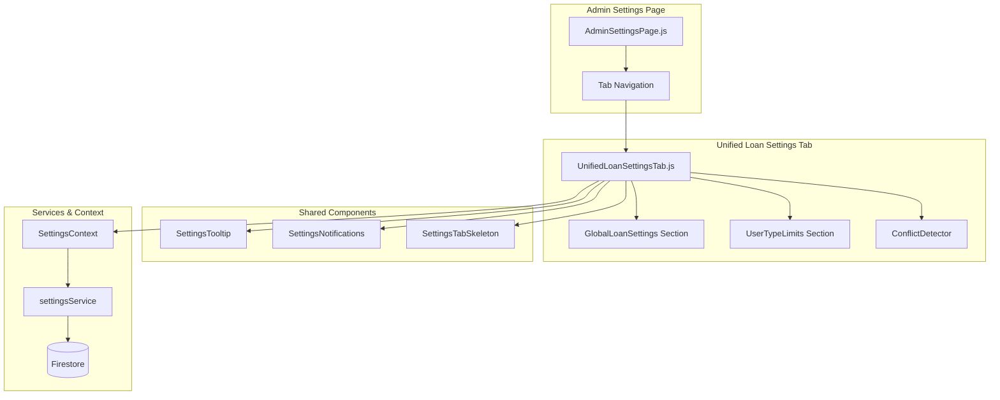

# Design Document: Unified Loan Settings

## Overview

การปรับปรุงหน้า Admin Settings โดยรวม LoanRulesTab และ UserTypeLimitsTab เข้าด้วยกันเป็น UnifiedLoanSettingsTab เพื่อให้ admin สามารถเห็นและจัดการการตั้งค่าการยืมทั้งหมดในที่เดียว ลดความสับสนและแสดงความสัมพันธ์ระหว่างค่าเริ่มต้นและค่าตามประเภทผู้ใช้อย่างชัดเจน

## Architecture



## Components and Interfaces

### 1. UnifiedLoanSettingsTab Component

```javascript
/**
 * UnifiedLoanSettingsTab - รวมการตั้งค่ากฎการยืมและการยืมตามประเภทผู้ใช้
 * 
 * Props: none (uses context)
 * 
 * State:
 * - globalSettings: { maxLoanDuration, maxAdvanceBookingDays, loanReturnStartTime, loanReturnEndTime }
 * - userTypeLimits: { teacher: {...}, staff: {...}, student: {...} }
 * - userTypeLimitsEnabled: boolean
 * - hasChanges: boolean
 * - isSaving: boolean
 * - errors: object
 * - conflicts: array
 */
```

### 2. GlobalLoanSettingsSection Component

```javascript
/**
 * GlobalLoanSettingsSection - ส่วนการตั้งค่ากฎการยืมเริ่มต้น
 * 
 * Props:
 * - settings: object - ค่าการตั้งค่าปัจจุบัน
 * - onChange: function - callback เมื่อค่าเปลี่ยน
 * - errors: object - validation errors
 * - disabled: boolean - ปิดการแก้ไข
 */
```

### 3. UserTypeLimitsSection Component

```javascript
/**
 * UserTypeLimitsSection - ส่วนการตั้งค่าตามประเภทผู้ใช้
 * 
 * Props:
 * - limits: object - ค่า limits ตามประเภทผู้ใช้
 * - globalSettings: object - ค่าเริ่มต้นของระบบ (สำหรับเปรียบเทียบ)
 * - enabled: boolean - เปิด/ปิดระบบ
 * - onToggleEnabled: function - callback เมื่อ toggle
 * - onChange: function - callback เมื่อค่าเปลี่ยน
 * - onToggleActive: function - callback เมื่อ toggle user type
 * - errors: object - validation errors
 * - conflicts: array - รายการ conflicts
 */
```

### 4. UserTypeCard Component (Reuse from existing)

```javascript
/**
 * UserTypeCard - การ์ดแสดงการตั้งค่าของแต่ละประเภทผู้ใช้
 * 
 * Props:
 * - userType: string - 'teacher' | 'staff' | 'student'
 * - limit: object - ค่า limits
 * - globalSettings: object - ค่าเริ่มต้น (สำหรับแสดง effective limit)
 * - disabled: boolean
 * - errors: object
 * - onLimitChange: function
 * - onToggleActive: function
 * - showEffectiveLimit: boolean - แสดงค่าที่มีผลจริง
 */
```

### 5. ConflictWarning Component

```javascript
/**
 * ConflictWarning - แสดงคำเตือนเมื่อมี conflicts
 * 
 * Props:
 * - conflicts: array - รายการ conflicts
 * - onDismiss: function - callback เมื่อปิด
 */
```

## Data Models

### Global Loan Settings

```javascript
{
  maxLoanDuration: number,        // 1-365 days
  maxAdvanceBookingDays: number,  // 1-365 days
  loanReturnStartTime: string,    // HH:MM format (optional)
  loanReturnEndTime: string       // HH:MM format (optional)
}
```

### User Type Limits

```javascript
{
  teacher: {
    maxItems: number,              // 1-50
    maxDays: number,               // 1-365
    maxAdvanceBookingDays: number, // 1-365
    isActive: boolean
  },
  staff: { ... },
  student: { ... }
}
```

### Conflict Object

```javascript
{
  type: 'warning' | 'error',
  userType: string,
  field: string,
  message: string,
  globalValue: number,
  userTypeValue: number
}
```

## Correctness Properties

*A property is a characteristic or behavior that should hold true across all valid executions of a system-essentially, a formal statement about what the system should do. Properties serve as the bridge between human-readable specifications and machine-verifiable correctness guarantees.*

### Property 1: Numeric range validation for loan settings
*For any* numeric input value for maxLoanDuration or maxAdvanceBookingDays, the validation function should accept values between 1 and 365 (inclusive) and reject values outside this range.
**Validates: Requirements 2.1, 2.2**

### Property 2: Settings persistence round-trip
*For any* valid global loan settings and user type limits, saving then loading should produce equivalent values.
**Validates: Requirements 2.3, 3.3**

### Property 3: Conflict detection for exceeding limits
*For any* user type limit that exceeds the corresponding global limit, the conflict detector should identify and report the conflict with the correct user type and field.
**Validates: Requirements 3.4, 4.2**

### Property 4: Effective limit calculation
*For any* combination of global limit and user type limit, the effective limit should be the minimum of the two values when user type limits are enabled, or the global limit when disabled.
**Validates: Requirements 4.3**

## Error Handling

### Validation Errors
- แสดง inline error message ใต้ field ที่มีปัญหา
- ปุ่ม Save จะ disabled เมื่อมี validation errors
- Error message เป็นภาษาไทยที่เข้าใจง่าย

### Save Errors
- แสดง error alert ด้านบนของ form
- เก็บค่าที่ยังไม่ได้บันทึกไว้ (ไม่ reset form)
- Log error ไปยัง console สำหรับ debugging

### Loading Errors
- แสดง skeleton loader ระหว่างโหลด
- ถ้าโหลดไม่สำเร็จ ใช้ค่า default และแสดง warning

## Testing Strategy

### Unit Tests
- ทดสอบ validation functions
- ทดสอบ conflict detection logic
- ทดสอบ effective limit calculation

### Property-Based Tests
ใช้ **fast-check** library สำหรับ property-based testing

- **Property 1**: Generate random numbers and verify validation accepts/rejects correctly
- **Property 2**: Generate random valid settings, save, load, and compare
- **Property 3**: Generate random limit combinations and verify conflict detection
- **Property 4**: Generate random global/user type limit pairs and verify effective limit calculation

### Integration Tests
- ทดสอบการ save/load settings กับ Firestore
- ทดสอบ responsive layout ที่ viewport sizes ต่างๆ

### Test Annotations
ทุก property-based test จะมี comment ในรูปแบบ:
```javascript
// **Feature: unified-loan-settings, Property {number}: {property_text}**
```

### Test Configuration
- Property tests จะรัน minimum 100 iterations
- ใช้ Jest + fast-check สำหรับ property-based testing
