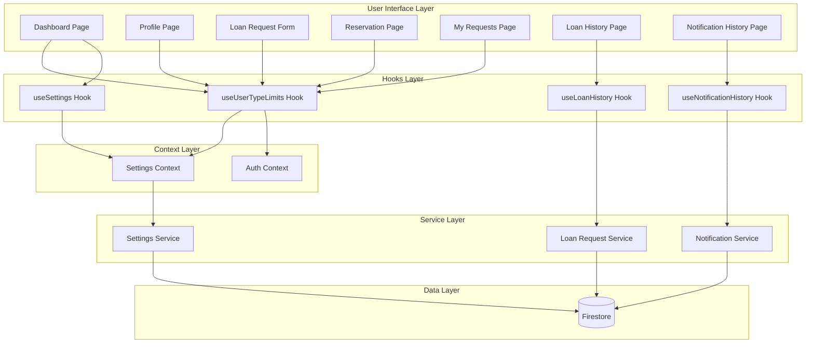

# Design Document

## Overview

ระบบปรับปรุงสถานะผู้ใช้ (User Status System Improvement) เป็นการพัฒนาเพื่อบูรณาการ User Type Limits จาก Admin Settings System เข้ากับหน้าต่างๆ ที่ผู้ใช้เข้าถึง โดยมีเป้าหมายหลักคือ:

1. แสดงสิทธิ์การยืมและกฎระเบียบให้ผู้ใช้เห็นในหน้า Dashboard
2. บังคับใช้ข้อจำกัดตาม User Type ในการยืมและจองอุปกรณ์
3. สร้าง Hook สำหรับดึงข้อมูล User Type Limits
4. เพิ่มหน้าประวัติการยืม-คืนและประวัติการแจ้งเตือน

## Architecture



## Components and Interfaces

### 1. useUserTypeLimits Hook

```typescript
interface UserTypeLimits {
  maxItems: number;
  maxDays: number;
  maxAdvanceBookingDays: number;
  userType: 'teacher' | 'staff' | 'student' | null;
  userTypeName: string;
  isEnabled: boolean;
  isDefault: boolean;
  warning: string | null;
}

interface UseUserTypeLimitsReturn {
  limits: UserTypeLimits;
  loading: boolean;
  error: Error | null;
  currentBorrowedCount: number;
  pendingRequestsCount: number;
  remainingQuota: number;
  canBorrow: boolean;
  refresh: () => Promise<void>;
}
```

### 2. BorrowingLimitsCard Component

```typescript
interface BorrowingLimitsCardProps {
  limits: UserTypeLimits;
  currentBorrowedCount: number;
  pendingRequestsCount: number;
  remainingQuota: number;
  showRules?: boolean;
}
```

### 3. LoanRulesSection Component

```typescript
interface LoanRulesSectionProps {
  settings: SystemSettings;
  closedDates: ClosedDate[];
}
```

### 4. useLoanHistory Hook

```typescript
interface LoanHistoryItem {
  id: string;
  equipmentId: string;
  equipmentName: string;
  equipmentCategory: string;
  borrowDate: Date;
  returnDate: Date | null;
  actualReturnDate: Date | null;
  loanDuration: number;
  status: 'completed' | 'returned_late' | 'active';
}

interface LoanHistoryStats {
  totalLoans: number;
  averageDuration: number;
  onTimeReturnRate: number;
}

interface UseLoanHistoryReturn {
  history: LoanHistoryItem[];
  stats: LoanHistoryStats;
  loading: boolean;
  error: Error | null;
  filters: LoanHistoryFilters;
  setFilters: (filters: LoanHistoryFilters) => void;
  search: (query: string) => void;
}
```

### 5. useNotificationHistory Hook

```typescript
interface NotificationHistoryItem {
  id: string;
  title: string;
  content: string;
  type: 'system' | 'loan' | 'approval' | 'reminder';
  timestamp: Date;
  isRead: boolean;
}

interface UseNotificationHistoryReturn {
  notifications: NotificationHistoryItem[];
  groupedByDate: Record<string, NotificationHistoryItem[]>;
  loading: boolean;
  error: Error | null;
  filters: NotificationFilters;
  setFilters: (filters: NotificationFilters) => void;
  markAsRead: (notificationId: string) => Promise<void>;
  markAllAsRead: () => Promise<void>;
}
```

## Data Models

### User Type Limits (from Settings Collection)

```typescript
interface UserTypeLimitDocument {
  userType: 'teacher' | 'staff' | 'student';
  userTypeName: string;
  maxItems: number;
  maxDays: number;
  maxAdvanceBookingDays: number;
  isActive: boolean;
  updatedAt: Timestamp;
  updatedBy: string;
}
```

### Loan History Query

```typescript
// Query from loanRequests collection
// Filter: userId == currentUser.uid AND status IN ['completed', 'returned', 'returned_late']
// Order: createdAt DESC
```

### Notification History Query

```typescript
// Query from notifications collection
// Filter: userId == currentUser.uid
// Order: createdAt DESC
```

## Correctness Properties

*A property is a characteristic or behavior that should hold true across all valid executions of a system-essentially, a formal statement about what the system should do. Properties serve as the bridge between human-readable specifications and machine-verifiable correctness guarantees.*

### Property 1: User Type Limits Return Correct Values
*For any* user with a valid user type (teacher/staff/student), when userTypeLimitsEnabled is true, the useUserTypeLimits hook should return the limits configured for that user type in settings.
**Validates: Requirements 1.2, 7.3**

### Property 2: Default Limits Fallback
*For any* user, when userTypeLimitsEnabled is false, the useUserTypeLimits hook should return the default system-wide limits (maxLoanDuration, maxAdvanceBookingDays, defaultCategoryLimit).
**Validates: Requirements 1.3, 2.5, 7.4**

### Property 3: Remaining Quota Calculation
*For any* user with maxItems limit M, currentBorrowedCount B, and pendingRequestsCount P, the remainingQuota should equal max(0, M - B - P).
**Validates: Requirements 1.4, 6.2, 6.4**

### Property 4: Loan Duration Enforcement
*For any* loan request with borrowDate and expectedReturnDate, the duration (expectedReturnDate - borrowDate) should not exceed the user's maxDays limit.
**Validates: Requirements 2.3, 4.2**

### Property 5: Advance Booking Enforcement
*For any* reservation with startDate, the number of days from today to startDate should not exceed the user's maxAdvanceBookingDays limit.
**Validates: Requirements 2.4, 5.2**

### Property 6: Max Items Enforcement
*For any* user attempting to create a loan request, if currentBorrowedCount + pendingRequestsCount >= maxItems, the request should be prevented.
**Validates: Requirements 2.2, 4.3**

### Property 7: User Type Label Mapping
*For any* user type value, the corresponding Thai label should be: teacher → "อาจารย์", staff → "เจ้าหน้าที่", student → "นักศึกษา".
**Validates: Requirements 3.1, 8.1**

### Property 8: Loan History Filtering
*For any* loan history filter with dateRange, category, and status, the returned results should only include items matching all specified filter criteria.
**Validates: Requirements 9.3**

### Property 9: Loan History Statistics Calculation
*For any* set of completed loans, the statistics should correctly calculate: totalLoans (count), averageDuration (sum of durations / count), onTimeReturnRate (on-time returns / total returns * 100).
**Validates: Requirements 9.4**

### Property 10: Notification Grouping by Date
*For any* set of notifications, when grouped by date, each notification should appear in exactly one group corresponding to its timestamp's date.
**Validates: Requirements 10.4**

### Property 11: Notification Read Status Update
*For any* notification marked as read, the isRead field should be true and the notification count should decrease by 1.
**Validates: Requirements 10.5**

## Error Handling

### Hook Error States

1. **Settings Loading Error**: แสดง default limits และ warning message
2. **User Type Not Set**: แสดง default limits พร้อม warning flag
3. **Network Error**: ใช้ cached data ถ้ามี, แสดง error message ถ้าไม่มี
4. **Permission Error**: แสดง error message และ redirect ถ้าจำเป็น

### Form Validation Errors

1. **Exceeded Max Items**: แสดง "คุณยืมอุปกรณ์ครบจำนวนสูงสุดแล้ว (X/X ชิ้น)"
2. **Exceeded Max Days**: แสดง "ระยะเวลายืมเกินกำหนด (สูงสุด X วัน)"
3. **Exceeded Advance Booking**: แสดง "ไม่สามารถจองล่วงหน้าเกิน X วัน"

## Testing Strategy

### Unit Testing

- ทดสอบ useUserTypeLimits hook กับ user types ต่างๆ
- ทดสอบ calculation functions (remainingQuota, statistics)
- ทดสอบ filter functions สำหรับ loan history และ notification history

### Property-Based Testing

ใช้ fast-check library สำหรับ property-based testing:

```javascript
// Example: Property test for remaining quota calculation
fc.property(
  fc.integer({ min: 1, max: 50 }), // maxItems
  fc.integer({ min: 0, max: 50 }), // borrowedCount
  fc.integer({ min: 0, max: 50 }), // pendingCount
  (maxItems, borrowed, pending) => {
    const result = calculateRemainingQuota(maxItems, borrowed, pending);
    return result === Math.max(0, maxItems - borrowed - pending);
  }
);
```

### Integration Testing

- ทดสอบการทำงานร่วมกันระหว่าง useUserTypeLimits และ SettingsContext
- ทดสอบการ enforce limits ใน loan request form
- ทดสอบการ enforce limits ใน reservation form
